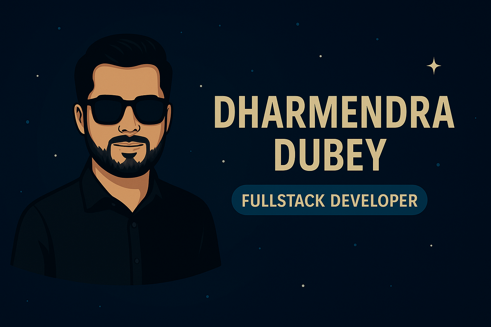

<h1 align="center">Hi 👋, I'm Dharmendra Dubey</h1>

  

<h2 align="center">🚀 Welcome to My Portfolio! 🚀</h2>

  

  

  
  
  

## 🚀 About Me
Hi, I'm **Dharmendra Dubey**, a dedicated **Fullstack Developer** with expertise in building scalable backend solutions, RESTful APIs, and dynamic frontend interfaces for seamless user experiences

### 🎯 What Drives Me
- 💻 **Problem Solving**: Finding elegant solutions to complex technical challenges
- 🚀 **Innovation**: Exploring cutting-edge technologies and best practices
- 🤝 **Collaboration**: Working with teams to build amazing products
- 📈 **Growth**: Continuously learning and improving my skills

## 🔥 What I Do
- 🌐 **Frontend Development**: ReactJs, Tailwind Css, Bootstrap, Material UI, Redux
- 🌐 **Backend Development**:  NodeJs, ExpressJs 
- 🛢 **Database Management**:   MongoDB, PostgreSQL, Redis  
- 🔨 **Testing Framework**:     Jest
- ☁ **Cloud & DevOps**:        AWS, Docker
- ☁ **Other Technologies**:    Microservices, Socket.io, GraphQL, Kafka, Firebase, CI/CD, MQTT, Low-Code/No-Code

## 📚 Currently Learning & Exploring
- 🏗️ **Microservices Architecture** - Scalable system design
- 🚀 **Kubernetes & Serverless** - Cloud-native development

## 🛠️ Technical Skills

  ### 💻 Programming Languages

 &nbsp;&nbsp;&nbsp;
 &nbsp;&nbsp;&nbsp;
 

### 🏗️ Frameworks & Libraries

  &nbsp;&nbsp;&nbsp;
  &nbsp;&nbsp;&nbsp;
  

### 🗄️ Databases & Caching

   &nbsp;&nbsp;&nbsp;
   &nbsp;&nbsp;&nbsp;
  

### 🛠️ Cloud Tools & Technologies

&nbsp;&nbsp;&nbsp;
&nbsp;&nbsp;&nbsp; 
&nbsp;&nbsp;&nbsp;
 &nbsp;&nbsp;&nbsp;
 &nbsp;&nbsp;&nbsp;
 &nbsp;&nbsp;&nbsp;

## 📊 GitHub Analytics

  

  

  

### 🏆 GitHub Achievements

  

## 📫 Let's Connect!
I'm always open to discussing new opportunities, collaborations, or just having a chat about technology!

  
  

## 🎯 What I'm Looking For
- 🚀 **Exciting Projects** - Opportunities to work on innovative solutions
- 🤝 **Collaborations** - Open source contributions and team projects
- 📚 **Learning** - Mentorship and knowledge sharing
- 💼 **Career Growth** - Full-time opportunities in backend development

  

### ⭐️ **Star this repository if you find my work interesting!**

### 📧 **Feel free to reach out for collaborations, opportunities, or just to say hello!**

*Last updated: January 2025*
